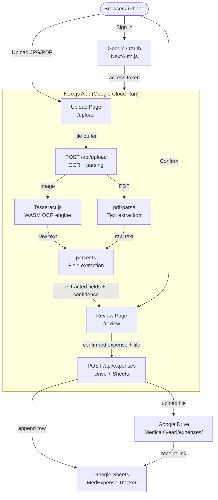

# AI Medical Expense Tracker

A personal web application for managing family medical expenses and preparing Irish tax returns. Upload a receipt photo or PDF, review the OCR-extracted data, and save it — the app files the receipt to Google Drive and logs the expense to Google Sheets automatically.

Built for the Casey/Roche family to track ~100 receipts/year across 5 family members for Med 1 / Med 2 Irish tax relief claims.

---

## Features

- **Receipt upload** — drag-and-drop or file picker, JPG and PDF supported
- **OCR extraction** — automatically reads date, amount, patient name, practitioner type, and treatment from the receipt
- **Smart review** — editable form pre-populated from OCR; low-confidence fields highlighted in amber
- **Irish tax classification** — auto-classifies each expense as Med 1 or Med 2 based on practitioner type, with non-routine dental overrides
- **Reimbursement tracking** — record insurer name and reimbursed amount; net claimable amount calculated automatically
- **Google Drive filing** — receipt saved to `Medical/[year]/expenses/` with a structured filename
- **Google Sheets logging** — expense row appended to the correct year tab with a clickable receipt link
- **Multi-year support** — year derived from the invoice date, not upload date; folders and tabs created automatically

---

## Architecture



### Data flow

1. User uploads a receipt on `/upload`
2. `POST /api/upload` runs OCR (Tesseract for images, pdf-parse for PDFs) and parses the text into structured fields with confidence scores
3. Result is stored in `sessionStorage` and user is redirected to `/review`
4. User reviews and edits pre-populated fields; low-confidence fields are highlighted
5. On confirm, `POST /api/expenses` uploads the file to Google Drive and appends a row to Google Sheets
6. Success screen shows links to the filed receipt and spreadsheet

### Google Sheets columns

| Date | Family Member | Practitioner Type | Treatment | Amount (EUR) | Category | Reimbursed | Insurer | Reimbursed Amount | Net Claimable | Receipt Link | Upload Date |

### Google Drive folder structure

```
My Drive/
└── Medical/
    └── 2026/
        └── expenses/
            └── 2026-03-15_Luca-Casey_Physiotherapist_EUR85.00.jpg
```

### File naming convention

`YYYY-MM-DD_FirstName-LastName_PractitionerType_EURAmount.ext`

---

## Tech Stack

| Layer | Technology |
|---|---|
| Framework | Next.js 16 (App Router, TypeScript) |
| Styling | Tailwind CSS v4 |
| Authentication | NextAuth.js v5 beta + Google OAuth |
| OCR | Tesseract.js v7 (WASM, server-side) |
| PDF parsing | pdf-parse v1.1.1 |
| Google APIs | googleapis npm package |
| Deployment | Google Cloud Run |
| CI/CD | GitHub Actions |
| Node.js | v22 (see `.nvmrc`) |

---

## Local Development

### Prerequisites

- Node.js 22 (`nvm use 22`)
- A Google Cloud project with OAuth credentials (see below)

### 1. Clone and install

```bash
git clone git@github.com:aidancasey/AI-medical-expense-tracker.git
cd AI-medical-expense-tracker
npm install
```

### 2. Set up Google Cloud credentials

#### Create a Google Cloud project

1. Go to [console.cloud.google.com](https://console.cloud.google.com)
2. Create a new project (e.g. `MedExpense Tracker`)
3. Enable **Google Drive API** and **Google Sheets API** under APIs & Services → Library

#### Configure OAuth consent screen

1. APIs & Services → OAuth consent screen → External → Create
2. App name: `MedExpense Tracker`, add your Gmail as user support email
3. Skip scopes step → add your Gmail as a **Test user** → Save

#### Create OAuth credentials

1. APIs & Services → Credentials → Create Credentials → OAuth client ID
2. Application type: **Web application**
3. Add authorised redirect URI: `http://localhost:3000/api/auth/callback/google`
4. Copy the Client ID and Client Secret

### 3. Configure environment

```bash
cp .env.local.example .env.local
```

Edit `.env.local`:

```env
GOOGLE_CLIENT_ID=your-client-id.apps.googleusercontent.com
GOOGLE_CLIENT_SECRET=your-client-secret
NEXTAUTH_SECRET=<run: openssl rand -base64 32>
NEXTAUTH_URL=http://localhost:3000
GOOGLE_SPREADSHEET_ID=   # leave blank — auto-created on first use
```

### 4. Run

```bash
npm run dev
```

Open [localhost:3000](http://localhost:3000), sign in with Google, upload a receipt.

On the first save, the app creates a "MedExpense Tracker" spreadsheet in your Drive automatically. To pin it, copy the spreadsheet ID from the URL and add it to `GOOGLE_SPREADSHEET_ID`.

---

## Deployment (Google Cloud Run)

Pushes to `main` deploy automatically via GitHub Actions.

### First-time setup

#### 1. Enable GCP APIs and create Artifact Registry

```bash
gcloud config set project YOUR_PROJECT_ID

gcloud services enable run.googleapis.com artifactregistry.googleapis.com

gcloud artifacts repositories create medexpense \
  --repository-format=docker \
  --location=europe-west1
```

#### 2. Create a deployment service account

```bash
gcloud iam service-accounts create github-actions \
  --display-name="GitHub Actions deployer"

for role in roles/run.admin roles/artifactregistry.writer roles/iam.serviceAccountUser; do
  gcloud projects add-iam-policy-binding YOUR_PROJECT_ID \
    --member="serviceAccount:github-actions@YOUR_PROJECT_ID.iam.gserviceaccount.com" \
    --role="$role"
done

# Export key — paste contents into GitHub secret, then delete this file
gcloud iam service-accounts keys create gha-key.json \
  --iam-account=github-actions@YOUR_PROJECT_ID.iam.gserviceaccount.com
```

#### 3. Add GitHub Secrets

Go to: repo → Settings → Secrets and variables → Actions

| Secret | Value |
|---|---|
| `GCP_PROJECT_ID` | GCP project ID |
| `GCP_SA_KEY` | Full contents of `gha-key.json` |
| `GOOGLE_CLIENT_ID` | OAuth client ID |
| `GOOGLE_CLIENT_SECRET` | OAuth client secret |
| `NEXTAUTH_SECRET` | Random secret (`openssl rand -base64 32`) |
| `NEXTAUTH_URL` | Cloud Run URL (update after first deploy) |
| `GOOGLE_SPREADSHEET_ID` | Spreadsheet ID (optional) |

#### 4. Deploy

Push to `main` — GitHub Actions builds the Docker image and deploys to Cloud Run automatically.

#### 5. Post-deploy: update OAuth and NEXTAUTH_URL

Once you have the Cloud Run URL (e.g. `https://medexpense-xxxx-ew.a.run.app`):

1. Google Cloud Console → Credentials → OAuth client → add authorised redirect URI:
   ```
   https://YOUR_RUN_URL/api/auth/callback/google
   ```
2. Update the `NEXTAUTH_URL` GitHub secret to `https://YOUR_RUN_URL`
3. Trigger a redeploy:
   ```bash
   git commit --allow-empty -m "chore: update NEXTAUTH_URL" && git push
   ```

---

## Irish Tax Relief Reference

| Category | Practitioner Types |
|---|---|
| **Med 1** | GP, Consultant, Physiotherapist, Psychologist, Hospital, Pharmacist, Audiologist |
| **Med 2** | Dentist (routine), Orthodontist, Optician, Ophthalmologist, Speech Therapist |
| **Med 2 → Med 1 override** | Non-routine dental: crown, veneer, implant, root canal, bridge, periodontal, surgical |

Med 1 and Med 2 totals are tracked separately in Google Sheets to simplify completing the annual tax return forms.

---

## Family Members

Aidan Casey · Kyla Casey · Luca Casey · Mia Casey · Kari Roche

---

## Environment Variables Reference

| Variable | Required | Description |
|---|---|---|
| `GOOGLE_CLIENT_ID` | Yes | OAuth 2.0 client ID |
| `GOOGLE_CLIENT_SECRET` | Yes | OAuth 2.0 client secret |
| `NEXTAUTH_SECRET` | Yes | Random string for session encryption |
| `NEXTAUTH_URL` | Yes | App base URL (`http://localhost:3000` locally) |
| `GOOGLE_SPREADSHEET_ID` | No | Pins to an existing spreadsheet; auto-created if blank |
